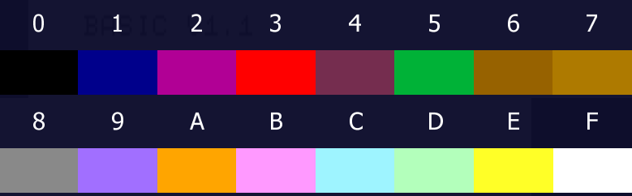

# DAI Personal Computer

## Technical Information

CPU: Intel 8080 2MHz

## Memory Map

| Memory Address | Description |
|----------------|-------------|
| `0000-BFFF` | RAM |
| `C000-DFFF` | ROM (non-switchable) |
| `E000-EFFF` | ROM (4 switchable banks) |
| `F000-F7FF` | ROM extension (optional) |
| `F800-F8FF` | CPU Stack |
| `F900-FFFF` | I/O |

### FIRMWARE MODULES

| Memory Address  | Description |
|-----------------|-------------|
| ` C000 -  C6BF` | Math. utilities |
| ` C6C0 -  C718` | Bank Switching |
| ` C719 -  D100` | BASIC handler |
| ` D101 -  D194` | string handler |
| ` D195 -  D23C` | Heap handler |
| ` D23D -  D8FA` | I/O handler |
| ` D8FB -  D9F4` | Interrupt handler |
| ` D9F5 -  DAD3` | Error handler |
| ` DAD4 -  DDD0` | Print routines |
| ` DDD1 -  DE01` | Encoding service routines |
| ` DE02 -  DEB4` | Single/double byte utilities |
| ` DEB5 - 0ECAA` | BASIC execution/run-time module |
| `0ECAB - 0EFFF` | List handler |
| `1E000 - 1EE6D` | Math. package |
| `1EE6E - 1EFFF` | Sound module |
| `2E000 - 2EBF3` | Screen driving package |
| `2EBF4 - 2EFFF` | Editor package |
| `3E000 - 3E9FF` | Encoding package |
| `3EA00 - 3EFFF` | Utility package |

### RAM

| Memory Address | Description |
|----------------|-------------|
| `0000-02EB` | DAI system-heap |
| `02EC-B350` | free RAM (mode-0) |
| `B350-BFFF` | video memory (mode-0) |

### Memory Mapped I/O

#### I/O Area

| Memory Address | Description |
|----------------|-------------|
| `F900-FAFF` | spare |
| `FB00-FBFF` | AMD9511 math chip (optional) |
| `FC00-FCFF` | 8253 programmable interval timer |
| `FD00-FDFF` | discrete devices |
| `FE00-FEFF` | 8255 PIO (DCE bus) |
| `FF00-FFFF` | timer + 5501 interrupt controller |

#### Discrete Devices

| Memory Address | bit | Description |
|------------|-----|-------------|
| `FD00` | | POR1 IN |
| | 0 | none |
| | 1 | none |
| | 2 | PIPGE: Page signal |
| | 3 | PIDTR: Serial output ready|
| | 4 | PIBU1: Button on paddle 1 (1 = closed) |
| | 5 | PIBU2: Button on paddle 2 (1 = closed) |
| | 6| PIRPI: Random data |
| | 7 | PICAI: Cassette input data |
| `FD01` | | PDLST:  IN  Single pulse used to trigger paddle timer circuit |
| `FD04` | | POR1:   OUT  |
| | 0-3 | Volume oscillator channel 0 |
| | 4-7 | Volume oscillator channel 1 |
| `FD05` | | POR1:   OUT  |
| | 0-3 | Volume oscillator channel 2 |
| | 4-7 | Volume random noise generator |
| `FD06` | | POR0:   OUT |
| | 0 | POCAS: Cassette data output |
| | 1 | PDLMSK: Paddle select |
| | 2 | PDPNA:  Paddle enable |
| | 3 | PIDTR: Serial output ready|
| | 4 | POCM1:  Cassette 1 motor control (0 = run) |
| | 5 | POCM2:  Cassette 2 motor control (0 = run)) |
| | 6-7 | ROM bank switching |

#### KEN-DOS ROM

| Memory Address | Description |
|----------------|-------------|
| `F000-F8FF` | KEN-DOS ROM |
| `F900-FAFF` | KEN-DOS heap/bank select address |
| `AD50` | KEN-DOS start of FAM (mode-0) |
| `AF50` | KEN-DOS start of directory (mode-0) |
| `F000` | Pointer to initializing-routine which enables KEN-DOS commands to be used in Basic programs |
| `FA50` | KEN-DOS start of bank-switch routine |
| `01B0` | Buffer for drive select byte |
| `0296` | Inswitch vector; 0 = RS232, 2 = pointer op #02E0 |
| `0297-0298` | Pointer to KEN-DOS command-table |
| `02C5-02EB` | Pointer for disk and/or cassette. Do not change these addresses! |
| `F98C-F98D` | On this address "10" is written during start-up. Second byte for motor-on time after finishing disk-access. Is used together with `#F9BC` as count-down buffer. |
| `FAFE-FAFF` | Offset pointers to relocate the 1.5Kbyte needed by the KEN-DOS system as buffer for FAM and directory |

## ROM ROM_Index

ROM INDEX compiled by Colin Hards - DAInamic 18 (October 1983)

__BANK 0:#C000 to #EFFF__

| Memory Address | Description |
|----------------|-------------|
| `C000` | Entry points |
| `C035` | Package Initialization |
| `C04B` | Load (00D0/1) on stack and continue on this address |
| `C05E` | Continue on (00D2/3) |
| `C06C` | Continue on (00D6/7) |
| `C073` | Continue on (00D2/3) |
| `C079` | Floating point compare |
| `C0AC` | Integer compare |
| `C0BB` | Increment integer number in memory |
| `C0D5` | Decrement integer number in memory |
| `C0F3` | Increment floating point number in memory |
| `C1FB` | Decrement floating point number in memory |
| `C21E` | Save FPAC on stack |
| `C234` | Retrieve FPAC from stack |
| `C249` | Input floating point number to FPAC |
| `C361` | Convert a floating point number for output |
| `C486` | Pretties up FPT or INT number |
| `C51A` | Move 11 bytes one memory location higher |
| `C531` | Move bytes one memory location down |
| `C573` | Input integer number to FPAC |
| `C5B2` | Convert integer number for output |
| `C614` | Input hex number to IAC |
| `C653` | Convert IAC to hex for output |
| `C6C0` | Math. restart (RST 4) |
| `C6CF` | ROM bank switching |
| `C6F2` | Switch to ROM bank |
| `C6FD` | Screen restart (RST 5) |
| `C70E` | Utility/encode (RST 1) |
| `C719` | Reset |
| `C7A8` | Initialization screen data |
| `C7E0` | Initialization parameters |
| `C7FB` | Check for highest RAM address |
| `C80C` | Start from scratch |
| `C918` | Encoding when line number is given |
| `C957` | Error while encoding a stored line |
| `C9D1` | Initialize program buffers |
| `CA01` | Memory management routine |
| `CA25` | Emergency stop routine (Graphics modes) |
| `CA34` | Find string BASIC instruction in table |
| `CB23` | Empty HEAP |
| `CB9E` | Load 0 into 4 consecutive memory locations |
| `CBBF` | Strings - BASIC commands |
| `CD64` | basiccmd TALK |
| `CD8B` | Pointers to strings of BASIC commands |
| `CE70` | Print ',' |
| `CE75` | Print a string between spaces |
| `CEB5` | Change screen MODE |
| `CEC6` | Set HEAP size to default value |
| `CECF` | Print DAI PERSONAL COMPUTER in medium resolution |
| `CEE4` | Select ROM bank 0, print message |
| `CEF9` | Print 'COMPUTER' under 'DAI PERSONAL' |
| `CF02` | Pointers to routines BASIC-COMMANDS |
| `CF86` | Strings arithmetic and logical operators |
| `D101` | Reset pointer 0000H |
| `D106` | Add string data after end other string |
| `D121` | Compare two strings |
| `D16D` | Transfer of string data |
| `D195` | Organize program buffers |
| `D1DB` | Keyboard scanning: Check source and input |
| `D236` | Set MSB of byte |
| `D23D` | basiccmd SAVE |
| `D270` | basiccmd LOAD |
| `D2A8` | Loading error |
| `D2B8` | Open tape file |
| `D2C3` | basiccmd CHECK |
| `D2F1` | Write block on tape |
| `D30F` | Write byte, update checksum |
| `D316` | Write block length, update checksum |
| `D325` | Start file reading |
| `D340` | Read block |
| `D384` | Read byte, calculate checksum |
| `D38D` | Read name length |
| `D3A2` | Read + check program name and file type |
| `D3F4` | Read file header |
| `D40C` | Write file leader |
| `D422` | Write file trailer |
| `D42E` | Start cassette motors |
| `D445` | Stop cassette motors |
| `D453` | Read bit |
| `D480` | Read leader |
| `D4D4` | Read byte |
| `D4ED` | Write leader |
| `D509` | Write byte |
| `D524` | Write bit |
| `D53C` | Write cycle |
| `D550` | Write trailer bits |
| `D560` | Initiate keyboard pointers |
| `D578` | Keyboard interrupt service (RST 6) |
| `D59A` | Scan keyboard, store result |
| `D606` | Break |
| `D620` | Complete keyboard scan |
| `D632` | Get ASCII value of key pressed |
| `D63F` | Get key-ASCII and store it |
| `D642` | Check if output to RS232 |
| `D668` | Write 2 blocks + trailer on tape |
| `D68D` | Cursor handling |
| `D695` | Print character |
| `D69C` | Keyboard scanning: Check if ASCII-buffer full |
| `D6A5` | Keyboard scanning: Check if new inputs |
| `D6BB` | Keyboard scanning |
| `D6DA` | Wait for spacebar |
| `D71A` | Stop loading programs |
| `D720` | Initiate writing file leader |
| `D72D` | Initialize SOUND gen, GIC, start HEAP, transfer CASSETTE data |
| `D750` | Check break pointer |
| `D755` | SOUND interrupt (RST 3) |
| `D783` | Failure during ropen |
| `D78A` | Check if LOAD during run program |
| `D790` | Check free RAM space |
| `D795` | Transfer CASSETTE vectors |
| `D7A4` | DISC/CASSETTE switching vectors |
| `D7D8` | Write block + trailer on tape |
| `D7DE` | Failure during ropen |
| `D7EB` | Write byte on CURSOR position address and update CURSOR position |
| `D7F8` | SAVE: Write name length |
| `D7FF` | Initialize loading from tape |
| `D81D` | basiccmd SAVEA |
| `D85E` | basiccmd LOADA |
| `D879` | Input from edit buffer |
| `D8A6` | Initiate SOUND generator |
| `D8C8` | Output to DCE-BUS |
| `D8E0` | Input from DCE-BUS |
| `D8FB` | Initialize interrupt system |
| `D949` | Set up interrupt vector area |
| `D96B` | Interrupt vector routine |
| `D973` | Update TICC interrupt mask |
| `D9A9` | Clock interrupt (RST 7) |
| `D9CD` | General interrupt return |
| `D9DB` | Enable clock interrupt |
| `D9E2` | Stack interrupt (RST 2) |
| `D9F5` | Error handling |
| `DA0B` | Pointers to error messages |
| `DA3D` | Error while running program/inputs |
| `DA50` | Print error message |
| `DA64` | Error when not running program |
| `DA75` | Print line number in which error occurred |
| `DA94` | Pointers to error messages |
| `DAD4` | Print message |
| `DB32` | Print string |
| `DB44` | Print string message |
| `DB6F` | Strings for matching messages |
| `DD1A` | Scan keyboard and print characters |
| `DD55` | Get X-coordinate CURSOR position |
| `DD60` | Output routine |
| `DD94` | Output to RS232 |
| `DDB4` | Input from RS232 |
| `DDBA` | RS232 frame error |
| `DDD1` | Get character from line, neglect TAB + SPACE |
| `DDE0` | Get character from line |
| `DE02` | Check if upper case character |
| `DE09` | Check if character is number or upper case |
| `DE14` | Compare (HL) and (DE) |
| `DE1A` | Calculate length of block |
| `DE26` | Two complement of 16-bits data |
| `DE30` | Calculate off-set address |
| `DE39` | Calculate address after string |
| `DE41` | Delay routine |
| `DE4F` | Data block transfer |
| `DE7C` | Load bank with identical data |
| `DEB5` | basiccmd NEW |
| `DED5` | basiccmd CONT |
| `DEFE` | basiccmd STEP |
| `DF03` | basiccmd STOP |
| `DF0C` | basiccmd END |
| `DF15` | basiccmd IF |
| `DF20` | basiccmd IF |
| `DF2A` | basiccmd GOSUB |
| `DF4C` | basiccmd RETURN |
| `DF63` | basiccmd GOTO |
| `DF6A` | basiccmd ON |
| `DF71` | basiccmd ON |
| `DF9E` | basiccmd RUN |
| `DFBA` | basiccmd RUN |
| `DFC0` | basiccmd POKE |
| `DFC9` | basiccmd OUT |
| `DFD5` | basiccmd WAIT |
| `DFF7` | basiccmd WAIT mem |
| `E016` | basiccmd WAIT TIME |
| `E02B` | basiccmd FOR |
| `E0C5` | basiccmd NEXT |
| `E0E5` | basiccmd NEXT |
| `E13C` | Save on soft break ?? |
| `E167` | Restore pointers to continue |
| `E18F` | basiccmd DATA - REM |
| `E197` | basiccmd LIST |
| `E1AA` | basiccmd LIST |
| `E1B6` | basiccmd LIST |
| `E1F5` | Run edit command |
| `E253` | List edit |
| `E25C` | List edit |
| `E265` | Initialize EDIT buffer |
| `E2B3` | basiccmd PRINT |
| `E2FC` | basiccmd INPUT |
| `E323` | basiccmd READ |
| `E401` | basiccmd RESTORE |
| `E45A` | basiccmd LET |
| `E4BC` | basiccmd SOUND  |
| `E50C` | basiccmd NOISE  |
| `E570` | basiccmd ENVELOPE |
| `E5B2` | basiccmd CURSOR |
| `E5BB` | basiccmd MODE |
| `E5C1` | basiccmd DOT |
| `E5CE` | basiccmd DRAW |
| `E5D7` | basiccmd FILL |
| `E60E` | basiccmd COLORT  |
| `E615` | basiccmd COLORG |
| `E62F` | basiccmd DIM |
| `E69E` | basiccmd UT |
| `E6A4` | basiccmd CALLM |
| `E6B5` | basiccmd CLEAR |
| `E6CE` | basiccmd TRON  |
| `E6D5` | basiccmd TROFF  |
| `E8EE` | Table of jumps to INT/FPT operator routines |
| `E9D9` | Calculate start address routines |
| `E9F0` | Pointers to start address routines |
| `EB51` | Calculate free RAM space |
| `EBC1` | Paddle operation (?) |
| `ECCC` | Print instruction from token |
| `ECF8` | Pointers to start address routines |
| `EE8D` | Set input direction |
| `EFED` | Print string |
| `EFF5` | Print character |

__BANK 1:#E000 to #EFFF__

| Memory Address | Description |
|----------------|-------------|
| `E000` | Entry points |
| `E0FE` | FPT multiplication |
| `E108` | FPT division |
| `E126` | Store registers ABCD in RAM 00D5-00D8 |
| `E133` | Restore registers ABCD from RAM 00D5-00D8 |
| `E16D` | Integer addition |
| `E18D` | Integer subtraction |
| `E1AC` | Integer multiplication |
| `E22B` | Integer division |
| `E3CF` | Store registers BCDE in RAM 00D5-00D8 |
| `E855` | FPT power |
| `EDAA` | FPT addition |
| `EDB4` | FPT subtraction |

__BANK 2:#E000 to #EFFF__

| Memory Address | Description |
|----------------|-------------|
| `E000` | Entry points |
| `E030` | Screen parameters MODE 0 |
| `E045` | Screen parameters MODE 1/1A |
| `E05A` | Screen parameters MODE 2/2A |
| `E06F` | Screen parameters MODE 3/3A |
| `E084` | Screen parameters MODE 4/4A |
| `E099` | Screen parameters MODE 5/5A |
| `E0AE` | Screen parameters MODE 4/6A |
| `E0C3` | Initialize screen |
| `E102` | Output one character |
| `E13D` | Output carriage return |
| `E159` | Output form feed |
| `E166` | Output backspace |
| `E1A9` | When end of line reached |
| `E1CB` | Scrolling |
| `E1FD` | Initialize screen character area |
| `E21C` | Change to character MODE |
| `E237` | Set text colors |
| `E254` | Set color parameters |
| `E267` | Load colors in header/trailer area |
| `E279` | Set cursor position |
| `E2CC` | Ask cursor position and size character screen |
| `E316` | Set cursor mode |
| `E330` | Update cursor pointers |
| `E344` | Flash cursor  |
| `E36B` | Load screen location pointed at by cursor |
| `E38B` | Get character from line |
| `E3D9` | Change MODE |
| `E407` | Set up screen RAM area |
| `E545` | Load pointers with screen parameters |
| `E59A` | Start addresses tables screen parameters |
| `E5A6` | Initialize memory management routine |
| `E5FC` | Initialize header |
| `E687` | Place cursor on beginning of line |
| `E6A4` | Set graphics colors |
| `E6F2` | (HL) = (HL) - (DE) |
| `E6FB` | Compare DE - HL |
| `E701` | Add offset to address |
| `E706` | Two complement of 16-bits data |
| `E710` | Draw a DOT on screen |
| `E71B` | Draw a line on the screen |
| `E818` | Fill a rectangular area on the screen |
| `E884` | Ask color of point and size of graphics screen |
| `EB46` | Calculate number of bytes on extended lines |
| `EBF4` | Initialize editor |
| `EC1E` | Obey edit |
| `EC4B` | Window up |
| `ECB3` | Window down |
| `ECF8` | Window right |
| `ED50` | Window left |
| `ED88` | Cursor up |
| `EDAB` | Cursor down |
| `EDD2` | Cursor left |
| `EDF6` | Cursor right |
| `EF4B` | Insert character in buffer |
| `EFCC` | Delete character in buffer |

__BANK 3:#E000 to #EFFF__

| Memory Address | Description |
|----------------|-------------|
| `E000` | Entry points |
| `E018` | Update input pointer |
| `E024` | Encode inputs without line number |
| `E04F` | Check if character after basiccmd is ':' or car. ret. |
| `E09A` | Get address encoding instruction and go to it |
| `E2E6` | Get char. from line, check if an upper case char. |
| `E2F1` | Strings variable types |
| `E81F` | Set D depending on contents of A |
| `E859` | Check statement terminator |
| `E8C5` | ASCII table upper case |
| `E8FD` | ASCII table lower case |
| `E935` | Get inputs from keyboard or RS232 |
| `E93F` | Load ASCII value for key pressed in buffer |
| `EA00` | Start UTILITY |
| `EA0D` | Initialize UTILITY |
| `EA62` | Error |
| `EA74` | Entry from BASIC |
| `EA7D` | Initialization parameters  |
| `EA8E` | Table with UTILITY commands |
| `EAB3` | D - Display  |
| `EADB` | Handle inputs after a UT command  |
| `EB15` | Convert ASCII-character to HEX-value  |
| `EB26` | L - Look |
| `EB41` | Set look windows, start look  |
| `EB56` | Go/Look check for carriage return |
| `EB5D` | Restart 0 (RST 0) |
| `EC45` | Compare DE with HL |
| `EC63` | Restore CPU registers |
| `EC7C` | Calculate DE - HL |
| `EC83` | M - Move |
| `ECBA` | Z - Reset |
| `ED01` | Print space |
| `ED06` | Scan keyboard, print character |

## Graphic

### Color Palette

[ROM Index](ROM_Index.md)
