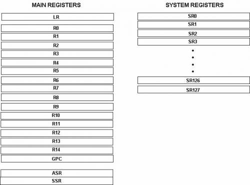
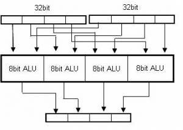
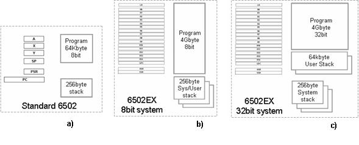
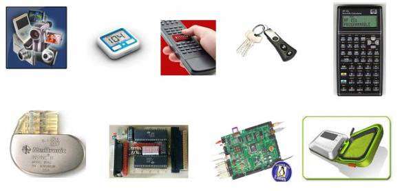
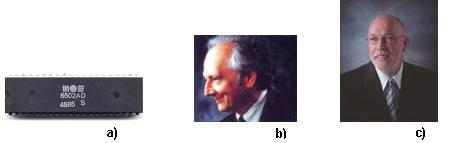
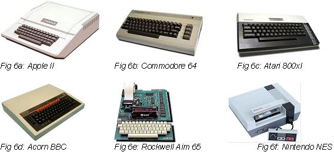
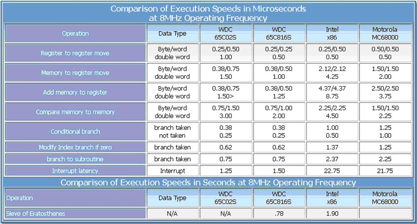
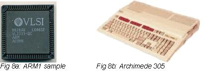

# The 6502ex

Extended 6502 for 8bit and 32bit Embedded Systems

References:
* http://www.ex6502.altervista.org/doku.php

The information reported on this page is proprietary of the author of the above site, all right reserved.

This page contains proprietary information that may be only used by persons in accordance to authorization under and to the extent permitted by the author of this site.

Information reported on this page is subject to change without notice according to continuous 6502EX development and improvements. All 6502EX details and 6502EX usage described in this page are given by the author in a good faith.

The author shall not be liable for any loss or damage deriving from the incorrect use of information contained in this page, or any error or omission in such information, or any incorrect use of the 6502EX.

Trademarks and pictures reported in this page are the exclusive property of their respective owners.

If you are interested to know more about 6502EX availability, please send an email to 6502ex [at] gmail [dot] com. We will be pleased to answer to your enquires.

## Introduction

The 6502EX is a 32bit extension of the popular 6502 8bit processor.

It has been conceived to offer a solution functionally and timing backward compatible with the original 6502 but, at the same time, it adds features today mandatory for modern applications and high level programming. It can be efficiently used both in 8bit and 32bit systems providing a low cost solution alternatively to entry level RISC cores.

The 6502EX has been designed to give a continuity path to the glorious 6502, bridging the 8bit and 32bit system gap without compromises and providing an easy way to migrate toward 32bit systems preserving the previous hardware and software investment.

The 6502EX is not a pure 32bit RISC implementation with the property to emulate the 6502 instruction set, at the same time, it is not a 32bit scaling up of the original 6502 memory/accumulator architecture. The 6502EX is a standard 6502 core augmented with features aimed to remove memory bottleneck introduced by pure memory/accumulator architecture and it offers the possibility to work on 32bit data, largely improving computational capability. It preserves the original 6502 instruction set allowing the user to mix new opcodes and legacy op-codes providing a seamless integration of the original programming model and the new one. So, compliancy with legacy 6502 code is intrinsic in the 6502EX architecture and does not require any emulation or specific operative mode to be activated.

The 6502EX extends the addressable memory space to 4Gbyte and performs vectored 32bit data operations both in low cost 8bit systems and high performance 32bit systems. Even if some deviations from the original architecture have been introduced to remove 6502 limitations, the 6502EX conserves the same design philosophy, the simplicity of usage and the same architecture efficiency of the original 6502. It offers a set of nineteen 32bit registers and a 32bit system registers space where an optional MMU, Cache, FPU or application specific coprocessors can be connected to. It adds 55 opcodes to the standard 6502 instruction set giving the possibility to mix legacy opcodes and new opcodes, executing 6502 legacy code in a cycle exact manner. Basically, the new opcodes cover three categories of instructions: 8/16/32bit load-store, 8/16/32bit logic/arithmetic data operations and 32bit miscellaneous instructions.

In the picture below is reported the programming model of the 6502EX.

Thanks to a vectored 32bit ALU, the 6502EX can execute four 8bit data operations in parallel, two 16bit data operations in parallel or a single 32bit data operation. The 32bit ALU can be seen as four 8bit elementary ALUs with their own set of flags (carry, negative, overflow and zero bit) stored into the status register. The 6502 legacy set of flags are preserved into the status register as well. The 6502EX can takes conditional program branches upon specific values of each set of flags.

The following figure shows a concept scheme of the vectored ALU.

The 6502EX core can be used in legacy 6502 8bit system, replacing the original 6502 processor and assuring binary code and timing backward compatibility. It can be used also in low cost 8bit system to expand the memory system and to take benefit of the new opcodes but the best benefits are allowed by using the 6502EX core in real 32bit systems achieving unprecedented level of code density and excellent performance. In this case 8bit, 16bit and 32bit memory load/store and data operations are allowed, giving a gain of up to 4x in term of data access bandwidth and computation capability.

The following figures represent the system models supported by the 6502EX.

As already mentioned, the 6502EX has been designed to give a continuity path to the famous 6502. It wants to address many kind of industrial applications like low-cost 8bit embedded system and high performance 32bit embedded systems as well as low-power systems (like biomedical implantable device), consumer applications and many kind of home-made designs. The 6502EX core in fact can be hosted into FPGA devices and used by 6502-based designers or by users of vintage home computers that want to improve their systems. Have a look to www.6502.org to find the most complete collection of documents, information and projects regarding the 6502.

Hereafter some pictures representing these kinds of systems.

It’s interesting to remind that the HP35S calculator, reported in Fig.4, it’s one of the most recent handheld calculator designed by HP (2007) and it mounts just a 6502 based MCU (from Sunplus) clocked at few Mhz.

In order to understand the efficiency of the original 6502 architecture and to understand the reasons why we decided to provide a “second step” to this core, we like to remind how the 6502 is born and in which systems it has been used in the past. Following this address http://www.commodore.ca/history/company/mos/mos_technology.htm you can read how this processor has been invented by MOS Technology thanks to Check Peddle and Bill Mensch. Bill Mensch is today CEO of Western Digital Center, a Company providing a 6502 compatible core (65C02S) and its 16bit derivative, the 65C816S.

The 6502 was really successful in the 70s-80s, it was used into the most important computers of that era. To have a better idea about the success of this core we invite you to visit the following link http://www.enotes.com/topic/List_of_home_computers_by_category#MOS_Technology_6502. It’s unbelievable to see the big number of computers, home computers and gaming console that toke benefit from this processor. All of you will recognize the famous Apple II, the Commodore 64, the Atari 400xl but also the Acorn BBC, the Rockwell Aim65 and the Nintendo NES gaming console.

The reason why the 6502 was a so successful processor in the industry is probable due to its intrinsic architecture efficiency and simplicity of usage. For whom interested to know more about the efficiency of this core and comparison with respect to other cores of the same era, please visit http://www.westerndesigncenter.com/wdc/AN001_%20Instruction_Level_Performance_Comparisons.cfm

The efficiency and simplicity of the 6502 core was so high that ARM Ltd, today leader in embedded RISC processors, was inspired just from the 6502 architecture when in the 1983 decided to design its first core, the ARM1. At that time the name of the Company was Acorn Computer, a famous home computer manufacturer, initially based on the 6502 processor, who sold successful machines like the BBC and the Archimede. Acorn had the problem to design the BBC successor using a more powerful processor but, after investigating about the performances offered by commercial cores available on the market (68xxx, x86 and similar), it decided to go for a proprietary solution able to significantly improve the efficiency of the 6502. Archimede was the first machine using the new ARM core. To know more about ARM history visit http://www.ot1.com/arm/armchap1.html.

## Architecture
The 6502EX is a standard Von Neumann architecture with capability to address 4Gbyte of memory in 8bit and 32bit systems. In the second case 8, 16 and 32bit access modes are allowed.

From a logic point of view, the 6502EX is designed as an extension of a standard 8bit core. Thanks to a new set of registers and a new set of instructions, 32bit risc-like capabilities are added in order to improve performances of the original 8bit core. The architecture supports a seamless integration between the legacy registers and the new registers as well as a seamless integration between legacy instructions and new instructions.

### Instruction Set Architecture
The resulting instruction set can be seen as the merging between legacy ISA (hereafter referred as ISA8) and the new ISA (hereafter referred as ISA32).

Fig1: Extended Instruction Set Architecture

The little overlap between ISA8 and ISA32 represents the few legacy instructions implemented differently in order to support the 6502EX architecture. These modified legacy instructions will not change their functional meaning and usage for the programmer.

The new instructions (ISA32) can be grouped in four groups:

1. Load/Store Five basic addressing modes are introduced. For some of them the possibility to access data in 8,16 and 32bit mode is allowed:
  * register
  * register with offset
  * register post-decremented
  * absolute
  * immediate (load only)

2. Logic and arithmetic Two basic addressing modes are introduced:
  * register-register
  * register-immediate

   On top to standard logic and arithmetic instructions, 32bit multiplications with and without sign and multiplications with accumulation are included in these categories. All the instructions can be used in a vectored form thanks to a new 32bit ALU that can be seen as four 8bit elementary units, two 16bit elementary units or a single 32bit unit allowing parallelism in algorithm computation.

3. Jumps In this category are included new instructions to perform program jumps (and segment switch) specifying the whole 32bit address in a register, as it was a linear 4Gbyte memory space, or a relative offset inside the segment:
  * Jump indirect
  * Jump indirect with link
  * Conditional relative jump (+/- 1Kbyte)
  * Unconditional relative jump (+/- 16Kbyte)

4. Miscellaneous In this category special instructions of different type are collected:
  * Move data from register bank to system register bank and viceversa
  * Copy 32bit registers into the Legacy Registers and viceversa
  * Manage vectored flags
  * Coprocessor instruction
  * System registers bit clear and reset

### Memory organization
The 6502EX can address up to 4Gbyte of memory physically implemented using 8bit or 32bit memory system.

From a logical point of view, the memory can be considered “segmented” since a jump instruction is needed to move from one segment to another. Using new jump modes, the segment and the offset into the segment (that is the full 32bit address) can be specified into a single instruction. Instead, using legacy jump instructions, segment switching can be achieved pre-charging a dedicated register with the new segment and then performing a legacy jump into the segment.

The segment is 64Kbyte large, there are 64K segments into the whole memory. The zero page and the stack can be remapped everywhere into the 64Kbyte segment. Every segment can have its zero page and its stack page, giving to the programmer the possibility to write application with multi zero-page and multi stacks capability, enabling context depended mechanisms or virtualization of multi-6502 machines.

Fig.2: Segmented Memory

### Interrupts
The 6502EX supports non-maskable and maskable interrupts with the same timing as the original 6502.

Upon interrupts, the 6502EX jumps to a memory location indicated by the interrupt table below located in segment zero (first segment of the whole memory space) at the following address:

Tab1: Interrupt Vector

The 6502EX executes the handler located at the interrupt vector specified into the proper interrupt entry point (see Tab1) inside the segment indicated into a specific system register (see system registers section afterword for detail). This way, the programmer can adopt context specific handlers for its application.

The 6502EX supports two new interrupt vectors located at FFF6, FFF7 and FFF8, FFF9:
  * the first is used when the COP instruction (coprocessor instruction) is executed to send a command to an external coprocessor but the addressed coprocessor is not connected to the 6502EX. In this case coprocessor emulation is allowed storing the coprocessor routine vector into the FFF6 and FFF7 locations.
  * the second is used to serve interrupt generated by the coprocessor when it finishes executing a task or an instruction.

### System and User stacks
The 6502EX support two different stack implementations, the 6502 legacy stack and a risc-like software stack.

The 6502 legacy stack is always used by the 6502EX to manage interrupts and can have a size of maximum 256byte (or 64 words). When an interrupt arise, the 6502EX saves the lower 16bit of the program counter (the legacy PC) and the Processor Status Register (the legacy PSR) into the stack as per the original 6502. Once the return address and the processor status are saved, the handler, if required, can save also the return memory segment into the stack using new dedicated instructions. The legacy stack is referred as the System Register.

The software stack instead has been designed to efficiently manage jump to subroutine in 32nit mode and can have a maximum size of 64Kbyte (or 16Kwords) allowing to save and to restore 32bit data in a single access. In this case new load/store instructions are required and a 32bit memory system is mandatory to support 32bit data accesses to the stack. The software stack is referred as the User Stack.

In case of 8bit system the System Stack can be used also to manage return address in case of jump to subroutine replacing the User Stack. In this case the System Stack and the User Stack are coincident.

Implementation of multi System Stacks and multi User Stacks is allowed into an application thanks to memory segmentation.

### Vectored ALU
The 6502EX implements a four ways ALU able to perform a single 32bit operation, two 16bit operations in parallel or four 8bit operations in parallel. This facility makes easier implementation of parallelism into program.

The figure below represents a conceptual high level scheme of the vectored ALU.

Fig.3: vectored ALU

Each elementary 8bit part of the ALU has its own set of flags (N, C, Z, V). In case of four 8bit calculations executed in parallel, four set of flags will be updated. Conditional branches can be taken upon the status of each set of flags.

These set of flags is contained into sixteen bits of the Actual Status Register (ASR).

Thanks to the vectored ALU, reliable or fault tolerant applications can be easily implemented duplicating each data operand (eight or sixteen bits) into the same 32-bit register and performing a vectored operation (e.g an add). A specific bit contained into the ASR register will flag if all the results (on eight or sixteen bits) are equal or not. In case of permanent or transient fault during the operation, results will be not the same and the 6502EX, if properly enabled, will generate an interrupt allowing an external supervisor to take actions and to recover from the fault.

### Register Bank
A main register bank includes nineteen 32bit registers classified as follow:

* **LR** (Legacy Register)
* **R0-R15** (R0-R7: General Purpose, R8-R15: Special)
* **ASR**, **SSR** (Actual and Saved Status Registers)

Fig.4 a) 6502EX full register set b) Legacy registers mapping

The first register is the Legacy Register (LR), it collects the full “register bank” of the original 6502 processor, it is composed by the Accumulator (A) and the two Index registers (X and Y). This is represented in Fig.4b. The CPL (Copy Legacy) instruction allows copying LR content into the others 32bit registers and viceversa. For this reason the LR register shall be considered as the register “bridge” between the legacy registers and the new registers. For example, a 32bit register content can be moved into LR using a single instruction and then, by means of legacy 6502 instruction acting on A, X and Y, the three bytes into LR can be pushed into the System Stack or used for generic computation. On the other hand, data originally stored into A, X, Y can be moved into a 32bit register using a single instruction. The content of this register could be used to save data into the 32bit User Stack or used for generic computation as well.

After the legacy register, sixteen 32bit registers named R0-15 are available for the application. This is the real register bank of the 6502EX. This set can be decomposed in two subsets

* **R0-R7**: General Purpose Registers (to manipulate data)
* **R8-R15**: Special Registers (to manipulate memory segmentation)

The new instructions can be applied indifferently to the full set of registers with the only difference that 8bit and 16bit operation are allowed only when R0-R7 are used as destination registers. This way, 8bit or 16bit load(store) will be possible using R0-R7 as destination(source) registers. Similarly, 8bit or 16bit vectored computations will be possible using R0-R7 as destination registers. R8-R15 will support only 32bit operations. Of course, 32bit operations are allowed on the full set of registers.

The following figure clarifies this concept when applied to load/store instructions.

Fig.5 a) R0-R7 as destination (load) or source (store) b) R8-R15 as destination (load) or source (store)

Looking at Fig.4 b, a special meaning is assigned to registers R10-R15. They are the principal registers used to manage memory segmentation.

Fig.6: Special Registers

Here after a quick overview of these registers:

* **CS (Code Segment)**: this register is typically used to enable segment switching using legacy 6502 instructions JMP and JSR. When used for this scope, only the higher 16bits are significant. CS shall be pre-charged with the new memory segment where the program shall jump to, then, upon JSR or JMP invocation the higher 16bit of the 32bit program counter will be copied with the value of CS[31:16] and a new segment will be used for the program. When new jumps with segment switch instructions are used, the new segment and its offset are directly specified into the instruction and CS pre-charging is not needed. If CS is not used for segment switching, it can be used as general purpose register.

* **DS (Data Segment)**: this register contains the value of the segment where data are read and written by the processor. Only the higher 16bits are significant. This way, the programmer has the possibility to separate the code from the data and map them in different segments. To change the data segment just charge a new value into DS. The next data will be accessed into the new segment. If the DS register is not used, it can be used as general purpose register.

* **ZS (Zero Page Segment)**: this register contains the value of the segment and the page inside that segment where the zero page shall be mapped to. Only the higher 24bits are significant (16bits for the segment, 8bit for the page into the segment). To change the zero page address, just charge a new value into ZS. The next zero page will be accessed into the new segment and/or the new page. If the ZS register is not used, it can be used as general purpose register.

* **SS (User Stack Segment)**: this register contains the value of the segment where the User Stack is mapped to. Only the higher 16bits are significant. To change the data segment, just charge a new value into SS. The next User Stack will be located into the specified segment. If the SS register is not used, it can be used as general purpose register.

* **LA (Link Address)**: this register is automatically updated upon invocation of the legacy JSR and the new JL instruction (jump to subroutine) as well as during interrupts processing. In all the cases the value of the 32bit return address is copied into the LA register. In order to manage re-entrant routine, the value of LA shall be saved into the stack. In case the System Stack is used as destination stack, the LR register shall be used to copy the value of LA into legacy registers.

* **GPC (Global Program Counter)**: this register contains the full 32bit memory address used by 6502EX to fetch instructions. The higher 16bit represents the active segment, the lower 16bit represents the offset inside the segment where the next instruction is fetched.

* **ASR (Actual Status Register)**: this register contains the legacy Processor Status Stack (PSR) in the most right eight bit (ASR[7:0]) and the four set of vectored flags into the field ASR[23:8].

Fig.7: Actual Status Register

When the vectored ALU is used, the four set of flags are updated accordingly. The flags contained into the legacy PSR will result as the logic OR between correspondent bits into the vectored flags field: e.g. the PSR carry bit will result as the logic OR among the others carry bit contained into ASR[23:16]. One, two or four carry bits will be involved according to the type of vectored operation (32,16 or 8 bit). This way the programmer can detect if at least one operation generated a carry and, if so, look for which one.

* **SSR (Saved Status Register)**: this register is copied with the content of ASR when an interrupt is processed. The interrupt handler will provide to save this register into the User Stack if required by the program. The PSR is always automatically saved into the System Stack.

### System Registers
The 6502EX can support a system register space where up to 128 optional registers can be connected. These registers can be used as GPIO to program or to control peripherals. Dedicated instructions allow moving the content of registers into system registers and viceversa.

The first two system registers (SR0 and SR1) located at address x00 and x01 are mandatory and fundamental for the functionality of the processor.

Fig.8: SR0 and SR1

* **SR0** (System Register 0): this register contains the legacy stack pointer SP into the most right byte. In the higher 16bits it is stored the value of the segment containing the System Stack and into the second byte from the right it is stored the page into which the System Register shall be mapped.
* **SR1** (System Register 1): this register contains the segment used by the processor to complete the 32bit address of the interrupt vector (see Tab1). The segment is stored into the higher 16bits. This way, a context dependent handlers is enabled changing the value into the SR1 register.

Specific instruction like the MVS (Move System Register) allows moving data between the register bank and the system registers.
Coprocessor support

A coprocessor is a custom auxiliary processor jointly working with the 6502EX. The coprocessor shall be connected to the system registers bus. The maximum number of coprocessors supported by the 6502EX is limited by the number of available system registers.

There are two possible operative modes applicable to the coprocessor: the coprocessor can work in parallel to the 6502EX (co-execution) without stalling the processor pipeline, or in synchronization with the processor (sync-up), meaning that the next processor instruction will be executed only when the current coprocessor operation is terminated. In this case the processor pipeline is synchronized with coprocessor pipeline. The usable operative mode is not coprocessor dependent but it can be negotiated on an instruction basis.

The following figure shows these two operative modes

Fig.9: two operative coprocessor modes

The COP instruction is used to send an instruction to the coprocessor. This instruction implements a register indexed load from memory to a specific system register where the command register of the coprocessor is mapped to. The register specified into the COP instruction acts as a pointer into the memory to the instruction to be loaded into the specified system register representing the coprocessor command register. After each COP instruction invocation, the index register is automatically incremented in order to point to the next instruction. Thanks to this register indexed addressing mode, the format and the semantic of the coprocessor instruction can be defined by the coprocessor designer with the maximum degree of flexibility.

In the following figure a coprocessor with the command (instruction) register connected to the system register SR64 is reported as an example.

Fig.10: cop instructions are fetched using a register indexed mechanism

Fig.11: example of coprocessor custom instruction format

On top to the two operative modes described (co-execution and sync-up), there are two hardware models that can be adopted by the designer to realize its coprocessor: standard and advanced.

**Standard model**
  * the coprocessor command register and the coprocessor registers bank are mapped into the 6502EX System Register space.
  * the 6502EX performs data load/store from memory and stores/loads those values into the coprocessor register bank (i.e. System register space) using the proper MSR (move system register) instruction.
  * the 6502EX performs the fetch of the coprocessor command and send it to the coprocessor by means of COP instruction (fig.10).
  * the coprocessor implements command decoding and command execution.

**Advanced model**
  * only the coprocessor command register is mapped into the system register space. As a consequence the coprocessor register bank is not directly accessible from 6502EX instructions.
  * the coprocessor performs data load/store from its local memory into its registers bank after sending load/store commands through the COP instruction (fig.10).
  * the 6502EX performs the fetch of the coprocessor instruction and send it to the coprocessor by means of COP instruction (fig.10).
  * the coprocessor implements command decoding and command execution including data load/store.

## Technical Requirements
The table summarizes the main 6502EX technical characteristics. For details, please have a look to the Architectural page.

## Versions
The 6502EX processor is offered in four different versions covering different needs in the 8bit and 32bit domain.

### 6502EX-RV
Reduced Version implementing only legacy instructions (ISA8) and very few ISA32 instructions aimed to manage memory segmentation. A reduced Register Bank is supported as well. Memory is limited to 16Mbyte on 8bit only. System Register space and coprocessor interfacing are not available on this core. This version is suggested to be used to replace legacy 6502 processor providing memory expansion with respect to traditional 64Kbyte.

Hereafter the programming model:

### 6502EX-LC
Low Cost 8bit bus version implementing legacy instructions (ISA8) and all the ISA32 instructions with exception of advanced arithmetic instructions like MAC, UMUL and SMUL and some kind of JUMP. Memory can be expanded up to 4Gbyte on 8bit only. A reduced System Register space and a reduced Register Bank are supported. Coprocessor interfacing instead is not supported. This version is suggested to implement low cost no demanding 8bit embedded system.

### 6502EX-HP
High Performance 32bit bus version implementing the full features of the 6502EX architecture. This version is recommended to implement high performance 32bit embedded system.

### 6502EX-VS
Vintage System version implementing the full 6502EX 32bit architecture just as the HP version. On top of that, the VS version adds a special auxiliary 8bit bus to be connected to old (vintage) hardware originally connected to a legacy 6502 processor. This bus is mapped to the first 64Kbyte of memory (first segment). In this way the VS version can be directly connected to a fast 32bit subsystem and, at the same time, to a slow vintage 8bit system replacing the original CPU. The synchronization of the signals between the vintage (slow) system and the 6502EX-VS is automatically provided by our core. This version is recommended to provide 32bit upgrade to old 8bit system allowing seamless integration between old and new hardware as well as integration of old and new software. Just as an example, the VS core could be used to upgrade the Commodore64 or the Apple II to 32bit preserving the original hardware and running the original applications and games.

All these core versions implement legacy 6502 code in a time accurate manner.

## Applications
In this page are describe some examples of 6502EX usage into different systems. These examples shall be considered at conceptual level, they are reported with the unique aim to inspire the user and to demonstrate the versatility of the 6502EX core.

### Single Core on extended 6502 bus
The following figure represents a block diagram of a generic simple platform based on a single 6502EX core connected to memory and to peripherals by means of extended 6502 bus. Basically, the extended 6502 bus implies larger memory space addressability (up to 32bit) and larger data memory support (8bit or 32bit). The extended 6502 bus contains also additional control signals not existing in the legacy bus protocol, they are not shown in the following schemes.

In this example the code/data bus is limited to 8bit.

Fig.1: Single Core platform on extended 6502 bus

The orange bus represents the 6502EX program fetch and data access bus. Memories are connected to this bus. A DMA facilitates data moving between the SPI and the memory.

The memory sub-system is built-up around a ROM and a synchronous RAM.

The blue bus represents the 6502EX System Register bus to which the user can connect the programming registers of his peripherals without interfering with the main bus. The System Register bus becomes the configuration bus of the system. Still in this example, the System Register bus is connected to General Porpoise Register (GPIO) to be used to control the external world.

### Single Core with Coprocessor on AHB bus
In this example the 6502EX is connected to a coprocessor through the System Register bus. The coprocessor in this case has local dedicated memories.

The 6502EX main bus and the System Register bus are wrapped respectively on AHB protocol and APB protocol.

The exposed AHB bus gives access to the huge number of legacy AHB peripherals available on the market.

The exposed APB bus is used as configuration bus to program AHB peripherals.

In this case the 6502EX main bus is 32bit large to speed up data access, enabling implementation of 32bit software stack for faster subroutine calls management.

Fig.2: Single Core with Coprocessor on AHB bus

### Twin Core with Coprocessor on extended 6502 bus
This is an interesting example showing a system composed by two 6502EX cores and two coprocessors realizing a low cost eyes tracking system.

Fig.3: eyes tracking system

The TCB block (Twin Core Bus) gives the possibility to easily connect the two 6502EX cores to the same memories and to the same peripherals without making the design complex. In fact, TCB exploits a time-division bus sharing principle that makes practically transparent to the user the management of the two cores running in parallel. Thanks to this technique the timing of the application is always predictable for both the threads (particularly suggested for strong real time application).

The bus clock (ckb) is supplied to TCB that derives two slower clocks (divided by two), ck1 and ck2, which are supplied respectively to core1 and core2. Pay attention that ck1 and ck2 are in counter-phase. This way, each core always takes its bus slot to make code/data accesses without interfering with the other.

Fig.4: bus and cores clock phases

Thanks to this clock scheme, the two cores can access the same memory without clock penalties (wait state due to arbitration).

The Camera interface connects the camera to the system in order to transfer the frames of the scene that will be processed by the eyes tracking algorithm running into the two cores and into the two coprocessors. Finally, the USB interface transfers the processed data externally to the host system that will take the proper action (e.g. a PC that moves the cursor on the monitor when the user watches the monitor and moves the eyes).

This MIPS demanding application is enabled thanks to a dedicated coprocessor (this application uses two of them connected to two different 6502EX) called GAZE.

GAZE is a sophisticated coprocessor implementing an optimized state of the art real time eyes tracking algorithm that makes possible silicon low cost implementation without performance compromise.

### Network of elementary Twin Core (node)
The following example represents an extreme use of a Twin Core module. As already seen in the previous example, a Twin Core module is a dual 6502EX core connected to a dedicated TCB module that allows a time-division bus sharing to preserve time predictability of each thread execution.

Fig.5: elementary node: dual threads processor

In the picture below a network of nine elementary nodes is connected to an external generic RISC that controls the network and collects data processed by the network.

Fig.6: network of nine nodes connected to a generic RISC

In this figure three accesses are shown:

* the green path represents a local data access of node 5 into its local memories. Here, the two local cores access two different data into the SRAM without arbitration policies.
* the red path represents a data read operation invoked by node 4 on node 9. The data read from the SRAM of node 9 is written into the local memory of node 4 and, after its usage, the result is stored again into its memory.
* Finally, the orange path represents a data read from SRAM of node 1 and the storage into the main memory.

This kind of solution can be used for highly parallelizable complex algorithm requiring high computational capability (e.g. multimedia applications or images processing) at low cost and low power consumption.

### Replacement of original 6502
This nice example shows how a daughter board based on a 6502EX core could replace the 6510 (basically a 6502) processor of the Commodore 64 in order to extend its computational capability.

The basic 64Kbyte memory system is extended with additional 1Mbyte of SRAM and 8Kbyte of Flash containing the boot code. An SD Card connected to the 6502EX bus provides support for ram disk.

Fig.7: Commodore 64 CPU replacement

The SPI interface connects the SD Card to transfer data in and out. In this example a low cost SPI is used for data transfer. Specific SD Card controller could be used to increase the transfer rate.

The 32bit to 8bit Adapter enables the possibility to connect the 6502EX bus (32bit) to the Commodore 8bit bus. It provides also clock synchronization between the Commodore clock system (1Mhz) and the 6502EX daughter board clock system that should have an higher clock, in the order of 100Mhz.

During the boot, the 6502EX loads and copies the Commodore Operating System into its local ram and makes it extremely faster during its execution.

Accesses to external devices like the VIC and the SID will be kept at original frequency (1Mhz).
